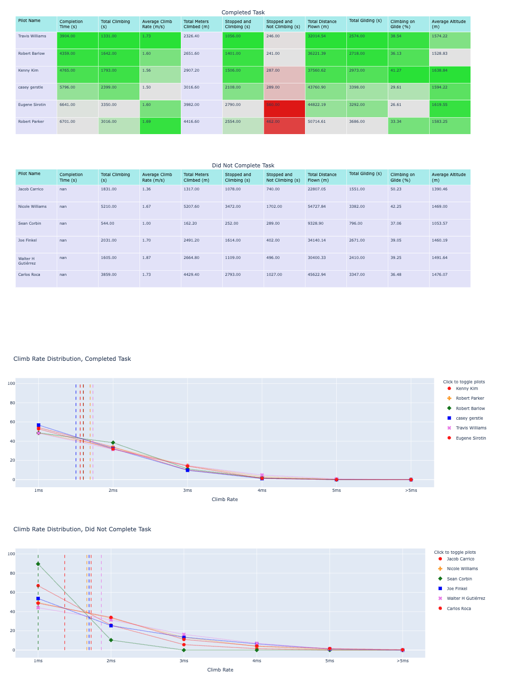
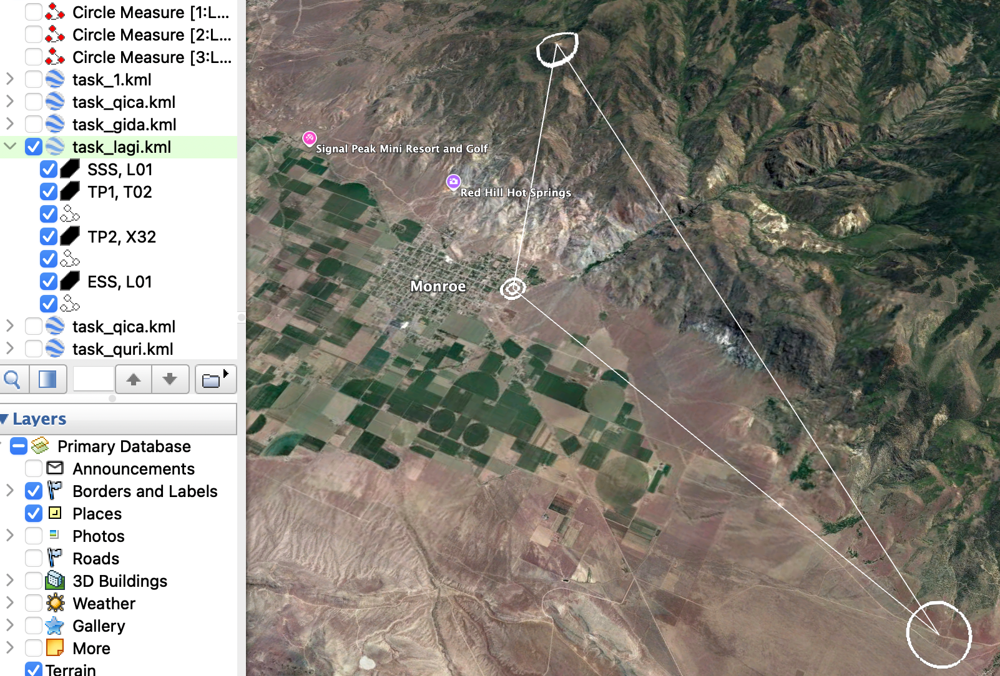
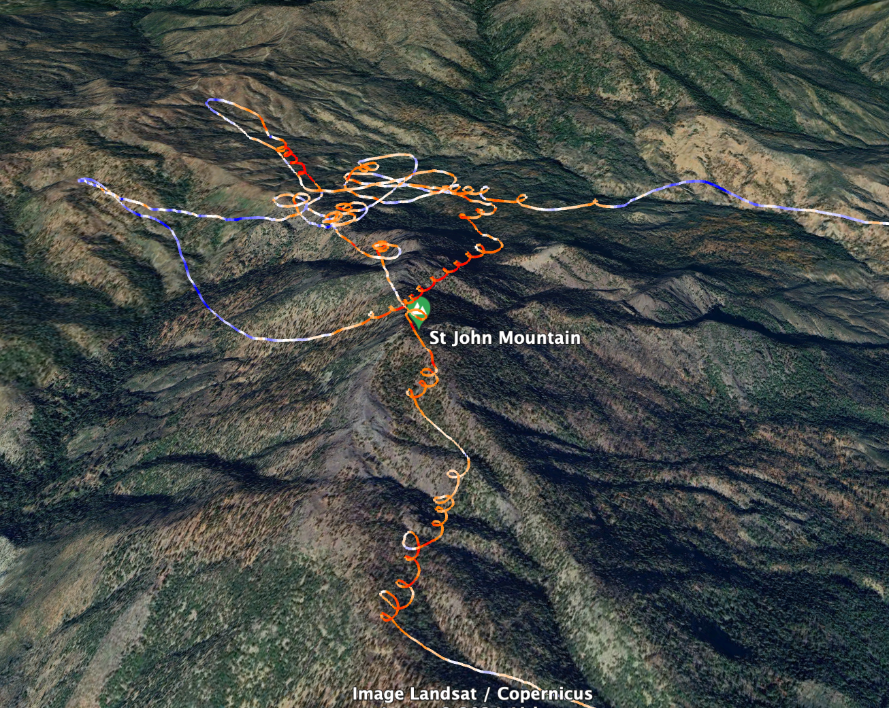
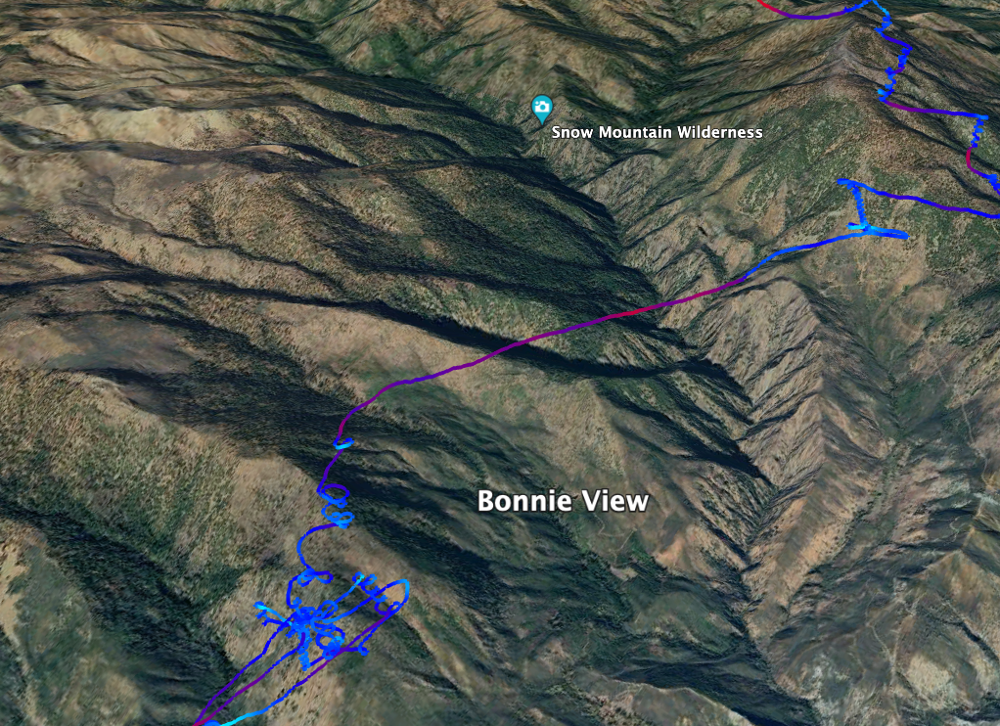

# ICG Tools
#### Rob Barlow, 2024-06
#### Last Updated: 2025-12-3

This library provides a number of functions for for working with .igc and .xctsk files. These files are used for paragliding tracklog recording and competion tasks (respectively). 

Primarily, the [igc_lib](igc_lib.py) and [xctsk_lib](xctsk_lib.py) libraries provide the icglog and xctsk objects, which can parse .igc and .xctsk files into python data objects for further operations. These libraries provide KML 3D format export for review in Google Earth.

These tools are used by the [comp_analysis](comp_analysis.py) module, which generates an html page with competiton flight analyis metrics from any number of tracklogs along with the competion task flown. I wrote an article on how to interpret these metrics [here](https://barlowr.com/content/projects/Flying_Better/competition-flight-analysis/competition-flight-analysis.html)


## Usage examples 

### Competition analysis
Run the following from the command line:
```
python3 comp_analysis.py --pilots_dir="<tracklog_folder_filepath>" --task_file="<xctsk_filepath>"
```

[Example competition analysis output](https://barlowr.com/content/projects/Flying_Better/competition-flight-analysis/competition_report.html)




### .xctsk convert to KML
Run the following from the command line:
```
python3 xctsk_lib.py --in_file="<your_xctsk_file>.xctsk"
```
Or:
```
python3 xctsk_lib.py --in_file="<your_xctsk_filepath>.xctsk" --out_file="<your_kml_output_filepath>"
```




### .igc convert to KML
Run the following from the command line:
```
python3 igc_lib.py --in_file="<your_igc_file>.igc"
```
Or:
```
python3 igc_lib.py --in_file="<your_igc_filepath>.igc" --out_file="<your_kml_output_filepath>"
```

Two KMLs are provided:
* Track log line colored by vertical speed, on a scale from blue (-4m/s) to white (-1 m/s) to red (4m/s). 



* Track log line colored by speed, on a scale from blue (20kmh) to white (35kmh) to red (55 kmh). 



